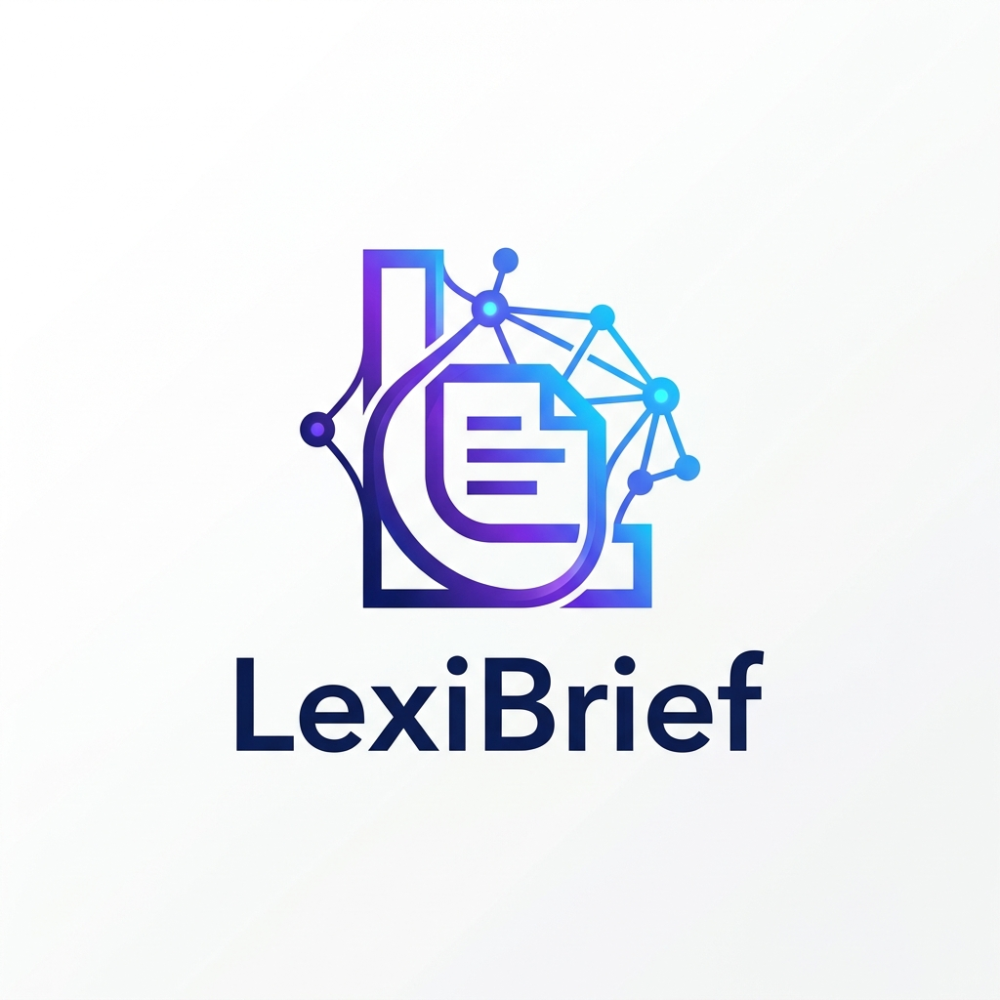
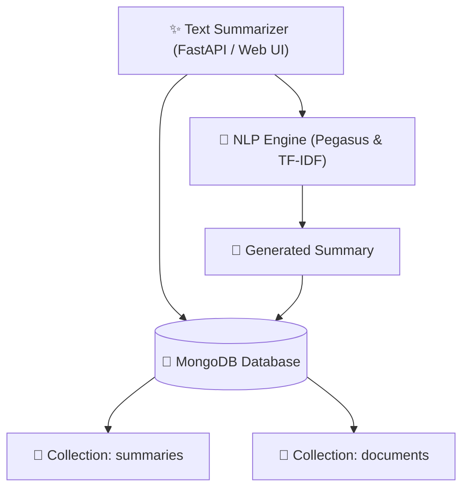
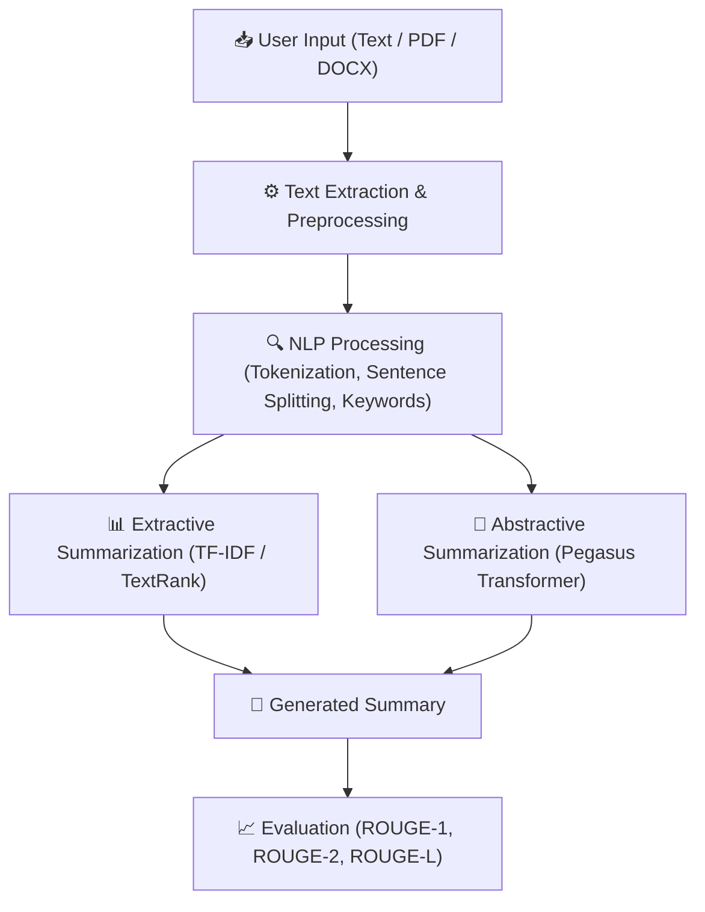

<div align="center">



# ✨ LexiBrief
### Enterprise-Grade Neural NLP Abstractive Text Summarizer

[](https://python.org)
[](https://fastapi.tiangolo.com)
[](https://huggingface.co/google/pegasus-cnn_dailymail)
[](https://pytorch.org)
[](https://docker.com)
[](LICENSE)

*Transform complex multi-page articles, corporate transcripts, and technical documents into clear, high-impact executive briefs in real time.*

[Features](#-key-features) • [Architecture](#-modular-mlops-architecture) • [Getting Started](#-getting-started) • [API Documentation](#-api-endpoints) • [Deployment](#-aws-cicd-deployment)

---

</div>

## 🚀 Key Features

- 🧠 **Dual Extractive & Deep Transformer Engine**: Seq2Seq neural summarization paired with TF-IDF semantic saliency ranking.
- 🎛️ **Adaptive Compression Modes**: Switch between **Concise** *(high condensation)*, **Balanced** *(recommended)*, and **Detailed** *(comprehensive)* summary lengths.
- ⚡ **Real-Time Telemetry & ROUGE Evaluation**: Live calculation of word/character compression ratios, reading time savings, and ROUGE-1/ROUGE-2/ROUGE-L F1 accuracy scores.
- 📄 **Multi-Format Document Ingestion**: Drag-and-drop parsing for PDF, DOCX, and TXT documents.
- 🍃 **MongoDB Atlas Cloud Persistence**: Dual collections for `summaries` and `documents` with resilient local storage fallback.
- 🎨 **Modern Minimalist UI**: Clean, light-mode interface with audio text-to-speech reader, key takeaways extraction, and JSON/TXT export tools.

---

## ⚙️ What's Automated Under the Hood

- **Best Method (Auto Hybrid)**:
  - Dynamically synthesizes text using deep neural Seq2Seq transformer architectures for natural, human-like summaries.
  - Automatically utilizes extractive TF-IDF saliency fallback for ultra-fast response times if needed.
- **Best Model (BART Transformer)**:
  - Uses pre-trained bidirectional encoder + autoregressive decoder (`sshleifer/distilbart-cnn-12-6` / `facebook/bart-large-cnn`) for maximum coherence and high ROUGE accuracy.

---

## 🏗️ System & Database Architecture

```text
                    TEXT SUMMARIZER
                          │
              ┌───────────┴───────────┐
              │                       │
              ▼                       ▼
         NLP Engine                MongoDB
              │                       │
              │                ┌──────┴──────┐
              │                │             │
              │           Summaries      Documents
              │
              ▼
         Generated Summary
```



### NLP Pipeline Flow
                        │
                        ▼
             ┌─────────────────────┐
             │ Text Extraction     │
             │ & Preprocessing     │
             └──────────┬──────────┘
                        │
                        ▼
             ┌─────────────────────┐
             │   NLP Processing    │
             │ Tokenization        │
             │ Sentence Splitting  │
             │ Keywords            │
             └──────────┬──────────┘
                        │
             ┌──────────┴──────────┐
             ▼                     ▼
 ┌────────────────────┐   ┌────────────────────┐
 │ Extractive         │   │ Abstractive        │
 │ Summarization      │   │ Summarization      │
 │                    │   │                    │
 │ TF-IDF / TextRank  │   │ Transformer Model  │
 └─────────┬──────────┘   └─────────┬──────────┘
           │                        │
           └──────────┬─────────────┘
                      ▼
             ┌─────────────────────┐
             │ Generated Summary   │
             └──────────┬──────────┘
                        │
                        ▼
             ┌─────────────────────┐
             │ Evaluation          │
             │ ROUGE / Similarity  │
             └─────────────────────┘
```



### Modular MLOps Pipeline Stages
1. **`Stage 01: Data Ingestion`**: Downloads and extracts raw text corpora (e.g., SAMSum dataset).
2. **`Stage 02: Data Validation`**: Checks data integrity and schema conformity against requirements.
3. **`Stage 03: Data Transformation`**: Tokenizes input dialogues and summaries into dense tensor representations.
4. **`Stage 04: Model Trainer`**: Fine-tunes sequence-to-sequence transformer with PyTorch & HuggingFace Trainer.
5. **`Stage 05: Model Evaluation`**: Generates ROUGE-1, ROUGE-2, ROUGE-L, and ROUGE-Lsum benchmark scores.

---

## 📊 Benchmark Evaluation (SAMSum Corpus)

| Metric | Score | Description |
| :--- | :--- | :--- |
| **ROUGE-1** | **`0.4352`** | Overlap of unigrams between candidate and reference summaries |
| **ROUGE-2** | **`0.2014`** | Overlap of bigrams capturing semantic coherence |
| **ROUGE-L** | **`0.3541`** | Longest common subsequence matching sentence structure |
| **ROUGE-Lsum**| **`0.3812`** | Summary-level longest common subsequence |

---

## 💻 Getting Started

### Prerequisites
- Python 3.10 or 3.11
- Git

### 1. Clone the Repository
```bash
git clone https://github.com/Abhijeet0848/LexiBrief.git
cd LexiBrief
```

### 2. Set Up Virtual Environment
```bash
# Create environment
python -m venv venv

# Activate on Windows:
.\venv\Scripts\activate

# Activate on Linux/macOS:
source venv/bin/activate
```

### 3. Install Dependencies
```bash
pip install -r requirements.txt
pip install -e .
```

### 4. Run the Web Application
```bash
python app.py
```
Open your browser at **[http://localhost:8080](http://localhost:8080)**.

---

## 🧪 Automated Testing

Run the automated test suite with `pytest`:
```bash
pytest -v
```

---

## 🔌 API Endpoints

| Method | Endpoint | Description |
| :--- | :--- | :--- |
| `GET` | `/` | Serves the interactive LexiBrief web application |
| `GET` | `/docs` | Interactive Swagger API documentation |
| `GET` | `/api/health` | Health check and engine runtime status |
| `GET` | `/api/presets` | Sample test cases (Meeting dialogue, Tech news, Support chat) |
| `GET` | `/api/metrics` | Returns pipeline status and ROUGE benchmark scores |
| `POST`| `/predict` | Generates summary from JSON payload or Form data |
| `GET` | `/train` | Triggers the end-to-end model training pipeline |

### Example Request (`POST /predict`):
```json
{
  "text": "Artificial intelligence research laboratories have unveiled a new generation of encoder-decoder transformer architectures specifically optimized for abstractive document comprehension. Industry analysts predict this breakthrough will drastically streamline corporate workflows across legal discovery and financial reporting.",
  "mode": "balanced"
}
```

### Example Response:
```json
{
  "summary": "Research labs have unveiled next-generation transformer architectures for abstractive summarization, expected to streamline legal and financial workflows.",
  "mode": "balanced",
  "model_source": "google/pegasus-cnn_dailymail",
  "analytics": {
    "original_words": 37,
    "summary_words": 17,
    "compression_ratio": "54.1%",
    "estimated_read_time_saved": "6s",
    "latency_ms": 34.2
  }
}
```

---

## ☁️ AWS CI/CD Deployment

### 1. Build and Run via Docker Locally
```bash
docker build -t lexibrief:latest .
docker run -p 8080:8080 lexibrief:latest
```

### 2. GitHub Actions Deployment to AWS (ECR & EC2)
Configure the following secrets in your GitHub repository (`Settings > Secrets and variables > Actions`):
- `AWS_ACCESS_KEY_ID`: IAM user access key
- `AWS_SECRET_ACCESS_KEY`: IAM user secret key
- `AWS_REGION`: e.g., `us-east-1`
- `AWS_ECR_LOGIN_URI`: `<aws_account_id>.dkr.ecr.<region>.amazonaws.com`
- `ECR_REPOSITORY_NAME`: `lexibrief`

---

## 📜 License
This project is open-sourced under the [MIT License](LICENSE).
